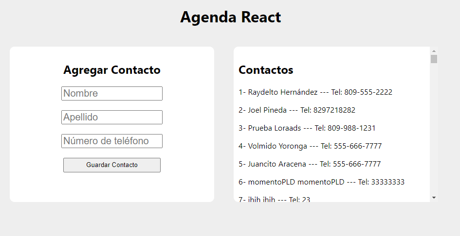

#NOTA: Cree el proyecto en VS Code con esta línea de código: npx create-react-app agenda_react, por esto hay algunos archivos adicionales.

Esta es la tarea #4 de José Tejada, esta es la captura del proyecto:
